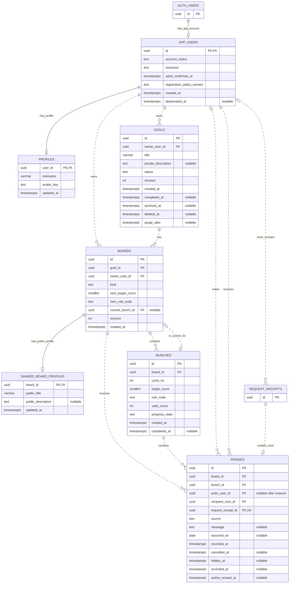
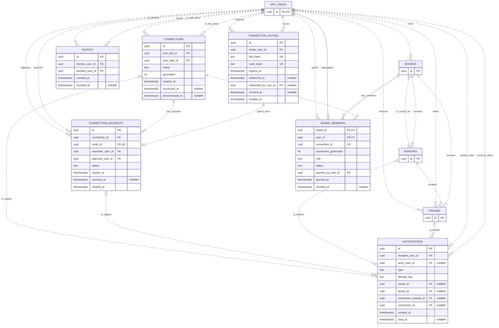
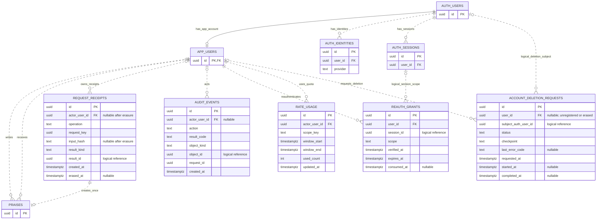

# 데이터 ERD와 관계·제약 설계

작성일: 2026-10-07 / 버전: ERD v0.3 / 상태: MVP 정책을 반영한 구현 전 관계 설계

기준: [제품 기획](product-plan-v0.2.md), [기술 아키텍처](technical-architecture.md), [로그인·권한](auth-and-permissions.md), [구현 전 고려사항](pre-implementation-plan.md).

I01~I09의 개발 기준은 [제품 규칙](policies/product-rules.md), [생명주기](policies/data-lifecycle.md), [응답 범위](policies/access-and-responses.md), [정책 JSON](../policies/app-policy.json)에 구체화했다. v0.2에는 목표 삭제 필드를, v0.3에는 성인 확인 시각·가입 정책 버전을 추가했다. 성인 개인 범위는 확정했으며 운영 주체 등 공개 출시 입력은 별도 상태로 관리한다. [가입 정책](policies/audience-and-signup.md)

**한 사용자의 목표에 개인판 1개와 선택적인 공유판 1개를 두고, 각 판의 포도송이 회차와 칭찬을 독립적으로 관리한다.** 사람 연결과 판 권한은 별개다.

이 ERD에는 제품 데이터 13개와 보조 데이터 5개, Supabase가 관리하는 Auth 참조 엔티티 3개를 표현했다. 표와 관계는 첫 구현의 설계 기준이며 아직 SQL 마이그레이션이나 실제 DB를 만든 상태는 아니다. Auth 엔티티의 필드는 관계 이해를 위한 일부만 표시하며 해당 스키마를 앱이 생성·변경하지 않는다.

## 도표와 원본

| 구분 | 내용 | Mermaid 원본 |
| --- | --- | --- |
| 핵심 기록 | 사용자·프로필·목표·판·회차·칭찬 | [핵심 ERD](diagrams/data-erd-core.mmd) |
| 연결과 공유 | 초대·요청·연결·차단·판 참여·소식 | [연결 ERD](diagrams/data-erd-connections.mmd) |
| 인증·운영 보조 | Auth 참조·중복 요청·재인증·요청 제한·감사·탈퇴 작업 | [운영 ERD](diagrams/data-erd-operations.mmd) |
| 전체 | 전체 속성과 관계 | [전체 ERD](diagrams/data-erd-full.mmd) |

외부 검토 보드를 사용할 때의 연결·접근 범위와 원본 관리 기준은 [외부 도구 연결](external-tools.md)을 따른다. 현재는 로컬 Mermaid 원본과 이 문서가 기준이다.

PK는 기본키, FK는 외래키, UK는 단일 컬럼 유일 제약이다. 복합 유일 제약은 아래 표에 따로 적는다. nullable 표기가 없는 앱 필드는 기본 NOT NULL 설계다. UUID는 식별자, timestamptz는 서버 시각이다.

관계 양끝의 ||는 1개, o|는 0~1개, o{는 0개 이상, |{는 1개 이상을 뜻한다. 실선은 부모 키가 자식의 기본키에 포함되는 식별 관계, 점선은 비식별 관계다. 실제 FK 여부는 속성의 FK 표시와 관계 표를 함께 본다. logical로 표시한 세션·작업 대상은 FK 없이 검사하는 참조다. 분할 도표의 외부 참조 엔티티는 키만 표시하기도 한다. [Mermaid ERD 표기](https://mermaid.js.org/syntax/entityRelationshipDiagram.html)

## 1. 사용자·목표·판·회차·칭찬

### 핵심 테이블의 책임

| 테이블 | 책임·주의점 |
| --- | --- |
| app_users | Auth UUID와 같은 앱 사용자 ID. 활성·탈퇴 처리 중 상태·시간대·최초 성인 확인 시각/버전은 본인 전용 |
| profiles | 허용된 관계에 보여 줄 닉네임·기본 아바타. 이메일·계정 설정 없음 |
| goals | 개인 원본 제목·설명·실제 목표 상태. 주인만 읽고 수정 |
| boards | personal/shared 종류, 다음 회차의 규칙·목표 개수, 현재 회차 포인터 |
| shared_board_profiles | 공유판에 표시할 제목·설명. 개인 원본을 그대로 조회하지 않음 |
| bunches | 판별 회차, 당시 목표 개수·규칙, 유효 개수·완성 상태 |
| praises | 한 판·회차의 1알 이벤트, 작성자·수신자·본문·정리 상태 |

### 판과 현재 회차

첫 버전은 UNIQUE(goal_id, kind)로 목표당 개인판·공유판을 각각 최대 1개만 둔다. 목표 생성 RPC가 개인판도 같은 트랜잭션에서 만든다. ‘목표에 개인판이 반드시 있음’이라는 자식 개수의 하한은 FK만으로 보장하지 않고 생성·삭제 RPC에서 지킨다.

boards.next_target_count와 next_rule_code는 새 회차에 쓸 설정이다. bunches.target_count와 rule_code는 생성 시점의 값이며 기존 회차 설정은 보존하는 안이다. current_bunch_id는 첫 칭찬 전에는 NULL이고 첫 부여 때 회차를 생성한다. 포인터가 가리키는 회차가 완성돼 있으면 다음 칭찬 때 새 회차를 만든다.

현재 회차와 완성 상태는 다른 개념이다. 예를 들어 1회차 완성 → 2회차에 칭찬 → 1회차의 칭찬 취소가 일어나면 1회차는 불완전한 지난 회차가 되고 현재 포인터는 2회차를 유지한다. progress_state='incomplete'인 행이 여러 개일 수 있지만 새 칭찬 입력 대상은 현재 포인터의 회차 하나다.

### 칭찬 상태와 집계

| 필드 | 의미 | 개수 영향 |
| --- | --- | --- |
| cancelled_at | 작성자의 취소 | 제외 |
| excluded_at | 수신자의 개수 제외 | 제외 |
| hidden_at | 수신자 화면에서 숨김 | 유지 |
| author_erased_at | 탈퇴·삭제 정책에 따라 작성자 연결·본문을 제거한 시각 | 정책에 따라 결정. 자동 취소로 간주하지 않음 |

valid_count는 해당 회차에서 cancelled_at IS NULL AND excluded_at IS NULL인 칭찬의 개수다. 두 상태가 동시에 있더라도 한 건을 두 번 빼지 않는다. 저장된 valid_count는 조회용 파생값이며 원본 칭찬으로 다시 계산할 수 있어야 한다. 칭찬 변경과 집계·완성·소식은 한 트랜잭션으로 처리한다.

actor_user_id의 NULL은 지정된 삭제 작업을 수용하는 경계다. 정상 신규 칭찬에는 현재 작성자 ID가 필수다. 사용자 API에서 NULL 작성자를 생성하지 못하게 하며 작성자 탈퇴 작업은 author_erased_at을 기록하고 actor·message·occurred_on을 제거한다. 미취소·미제외 기여 개수는 유지하고 수신 목표 정리 시 이벤트도 제거한다. [생명주기 정책](policies/data-lifecycle.md)을 따른다.

praises에 goal_id를 중복 저장하지 않고 board_id를 통해 찾는다. board_id와 recipient_user_id는 의도적으로 저장하고 복합 FK로 해당 판 주인과 일치하게 한다. source는 self/peer이며 개인판과 공유판에 맞는지 RPC에서 확인한다. occurred_on은 과거 실천일 기능을 채택할 경우 개인 칭찬에 사용하는 선택 필드다.

## 2. 연결·초대·권한·소식

### 관계 테이블의 책임

| 테이블 | 책임·주의점 |
| --- | --- |
| connections | 순서를 정규화한 두 사용자 쌍. 요청과 별도로 활성 연결을 나타냄 |
| blocks | 방향이 있는 차단. 한쪽의 활성 차단만 있어도 양쪽 새 연결·부여를 거절 |
| connection_invites | 링크·코드의 해시, 발급자, 24시간 만료, 한 번의 요청 사용 |
| connection_requests | 초대를 사용한 요청자와 최종 수락자, 48시간 만료·처리 결과 |
| board_members | 특정 공유판의 지인 권한. 주인은 boards.owner_user_id로 판단 |
| notifications | 수신자만 읽는 소식. 대상 ID와 종류만 저장하고 본문은 원본 권한으로 조회 |

connections는 처음 요청할 때 inactive, generation=0으로 만들 수 있다. 최종 수락으로 새 활성 연결이 성립할 때 generation을 1씩 올린다. 연결 해제는 inactive로 바꾸고 판 권한도 해제한다. 같은 요청의 중복 수락은 generation을 다시 올리지 않는다.

board_members.connection_generation은 권한 부여 당시 연결 회차다. 다시 연결돼 현재 generation이 달라지면 과거 권한은 사용할 수 없다. 이 값은 과거 스냅샷이므로 connections의 현재 generation에 대한 FK로 묶지 않는다. 읽기·쓰기가 현재 연결 ID·generation·활성 상태·차단을 함께 검사한다.

한 초대 행에 긴 링크 해시와 짧은 코드 해시를 함께 두며 어느 쪽으로 사용해도 같은 초대를 소모한다. UNIQUE(connection_requests.invite_id)로 초대 하나에 요청 한 건만 허용한다. 요청 생성·redeemed_at·redeemed_by_user_id 변경은 같은 트랜잭션이다.

동일 연결에 pending 요청은 최대 한 건이다. 반대 방향의 동시 요청도 같은 정규화 사용자 쌍과 잠금으로 정리한다. pending의 유일 제약은 상태를 기준으로 두고 만료 시간은 RPC에서 확인·상태 전이한다. 만료된 요청의 수락은 거절한다.

notifications에는 칭찬 본문·개인 설명·초대 비밀을 복사하지 않는다. type별 대상 포인터 조합을 검사하고 UNIQUE(recipient_user_id, dedupe_key)로 같은 소식을 중복 생성하지 않는다. 회차 완성 소식은 회차당 한 번 생성하는 설계안이다. 대상이 삭제됐거나 권한이 끝나면 소식 상세에서 원문을 반환하지 않는다.

## 3. 인증 참조와 운영 보조

### 보조 테이블의 책임

| 테이블 | 책임·주의점 |
| --- | --- |
| request_receipts | 작성자·작업·요청 키 유일성, 정규화한 입력 해시와 결과 ID. 원문 입력·토큰은 저장하지 않음 |
| audit_events | 권한·취소·운영 작업의 최소 감사 기록. 원문 목표·칭찬 내용은 저장하지 않음 |
| reauth_grants | 특정 사용자·현재 세션·민감 작업에 묶인 재인증, 만료·1회 소비 |
| rate_usage | DB 직접 RPC에도 적용할 사용자별 요청 제한 버킷. 범위·시간은 서버/DB가 계산 |
| account_deletion_requests | 계정 접근 중단 뒤 단계별 삭제·재시도·완료 상태 관리. 가입 미완료 Auth 정리는 user_id 없이 subject_auth_user_id로 진행 표시 |

Auth 사용자·identity·세션은 Supabase가 관리한다. 비밀번호·OTP·refresh token을 앱 테이블로 복제하지 않는다. 세션 확인은 현재 JWT의 session_id와 사용자만 확인하는 비공개 함수로 제한한다. [Supabase 사용자 데이터](https://supabase.com/docs/guides/auth/managing-user-data)

최초 Auth 인증 후에는 앱 계정 없이 가입 확인 화면을 제공한다. 검증된 Auth UUID·현재 세션·명시적인 성인 확인·현재 정책 버전으로 app_users·profiles 및 최초 확인 기록을 한 트랜잭션에서 한 번 생성하는 별도 초기화 경로를 둔다. 생성 실패는 재시도하며 기존 deleting 계정을 upsert로 active로 되돌리지 않는다. 일반 API는 active 앱 계정을 요구하고 초기화 경로는 아직 없는 앱 계정을 처리한다. POL-ACCOUNT-001을 따른다.

request_receipts.result_id와 audit_events.object_id는 종류에 따라 다른 테이블을 가리키는 논리 참조다. 보통의 FK로 모든 테이블을 동시에 참조한다고 표시하지 않았다. 지정 RPC가 결과 생성·기록을 같은 트랜잭션에서 완료하고 재조회 시 현재 권한을 검사한다. 칭찬은 request_receipt_id FK·UK로 실제 생성 요청과 연결한다.

입력 해시는 클라이언트가 준 문자열을 신뢰하지 않고 정규화한 입력으로 계산한다. 서버 시각·새 결과 ID처럼 재시도 때 달라지는 값은 해시 입력에 넣지 않는다. 완료된 결과에 원래의 생성 소식·개수 변경을 재적용하지 않는다. 작성자 삭제 시 요청 메타데이터 처리도 함께 정해야 한다.

reauth_grants.session_id는 Supabase 세션의 수명·정리와 결합하지 않도록 논리 참조로 두고 매번 실제 현재 세션을 확인한다. account_deletion_requests.subject_auth_user_id도 작업 중·삭제 이후 처리를 위한 비공개 논리 참조다. 두 테이블에 로그인 토큰을 저장하지 않는다.

탈퇴 작업은 사용자 ID가 없어져도 단계 완료·재시도 결과를 기록할 수 있게 user_id를 nullable로 둔다. 완료 작업·독립 최신 삭제 원장은 정리 완료부터 최소 37일, 미완료 작업은 완료까지 보관한다. 원장 저장 위치·접근·암호화·만료 설정은 서비스 개설 때 기록한다. 복원 시점보다 최신인 삭제 이력을 재적용하기 전에 복원 DB를 공개하지 않는다. POL-DELETE-002/003을 따른다.

## 4. 외래키·유일성·행 제약

| 대상 | 제약 설계 | 목적 |
| --- | --- | --- |
| app_users | id PK·FK → auth.users.id, adult_confirmed_at·registration_policy_version 필수 | 로그인 수단과 별개인 고정 앱 사용자 ID, 명시적 최초 가입 확인 |
| profiles | user_id PK·FK → app_users.id | 사용자당 표시 프로필 최대 1개 |
| goals | owner_user_id FK, UNIQUE(id, owner_user_id) | 주인 참조, 판 소유 검증용 후보키 |
| boards | (goal_id, owner_user_id) FK → goals(id, owner_user_id) | 다른 사람의 목표와 판 소유자 조합 거절 |
| boards | UNIQUE(goal_id, kind), UNIQUE(id, owner_user_id) | 첫 버전 판 종류별 1개, 수신자·권한 부여자 검증용 후보키 |
| shared_board_profiles | board_id PK·FK → boards.id | 판당 공유 표시 정보 최대 1개 |
| bunches | UNIQUE(board_id, cycle_no), UNIQUE(id, board_id) | 회차 번호 중복 방지, 칭찬·현재 포인터 검증용 후보키 |
| boards.current_bunch_id | (current_bunch_id, id) FK → bunches(id, board_id) | 다른 판의 회차를 현재 회차로 지정하지 못함 |
| praises | (bunch_id, board_id) FK → bunches(id, board_id) | 칭찬의 판·회차 불일치 거절 |
| praises | (board_id, recipient_user_id) FK → boards(id, owner_user_id) | 판의 주인과 수신자 불일치 거절 |
| praises | request_receipt_id FK·UNIQUE | 생성 요청 하나에 칭찬 최대 한 건 |
| connections | UNIQUE(user_low_id, user_high_id), CHECK(user_low_id < user_high_id) | 자기 연결·역순 중복 거절 |
| connection_invites | link_hash·code_hash 각각 UNIQUE, 두 값 필수 | 충돌·중복 비밀 거절, 원문 비밀 보관 금지 |
| connection_requests | invite_id UNIQUE, connection_id의 pending 부분 유일 인덱스 | 초대 재사용·양방향 대기 요청 중복 거절 |
| blocks | UNIQUE(blocker_user_id, blocked_user_id), 두 사용자 다름 | 방향별 한 행, 자기 차단 거절 |
| board_members | PK(board_id, user_id), connection_id FK | 판·지인별 권한 최대 한 행 |
| board_members | (board_id, granted_by_user_id) FK → boards(id, owner_user_id) | 주인 이외의 권한 부여자 거절 |
| notifications | UNIQUE(recipient_user_id, dedupe_key), 종류별 대상 필드 CHECK | 소식 중복·잘못된 대상 조합 거절 |
| request_receipts | UNIQUE(actor_user_id, operation, request_key) | 사용자·작업별 중복 전송 방지 |
| rate_usage | UNIQUE(actor_user_id, scope_key, window_start) | 같은 제한 버킷 중복 방지 |
| account_deletion_requests | subject_auth_user_id의 pending/running/failed 부분 유일 인덱스 | 앱 계정 없는 정리도 포함해 동일 Auth UUID의 삭제·재시도 작업 중복 금지 |

Auth 인증만 되고 정리 표시가 없는 상태는 app_users 행이 없는 signup_required이며 제품 권한을 갖지 않는다. bootstrap은 현재 Auth 세션·명시적 확인·정책 버전을 검사해 두 확인 필드를 서버 값으로 한 번 기록한다. 일반 수정·재로그인으로 확인 필드를 변경하지 못한다. 가입 미완료 정리 작업은 동일 사용자 잠금과 진행 중 정리 표시로 bootstrap과 직렬화한다.

모든 FK 표시 필드는 부모 엔티티의 해당 키를 참조한다. 표의 복합 FK가 있다면 개별 FK만으로 대체하지 않는다. 복합 FK 대상의 후보키는 먼저 UNIQUE로 선언한다. 현재 회차의 순환 참조는 테이블 생성 후 FK를 추가하고, 판 생성 시 포인터를 NULL로 둔 뒤 회차 생성·포인터 갱신을 같은 트랜잭션으로 처리한다.

행 내부 CHECK에는 판 종류 personal/shared, 칭찬 source self/peer, 1~100 목표 개수·양수 회차 번호, 0 <= valid_count <= target_count, window_end > window_start, used_count >= 0, 생성·만료 시간 관계를 넣는다. goals.status=deleted일 때 deleted_at·purge_after는 필수이고 purge_after > deleted_at이며, 그 밖의 상태에는 두 값이 NULL이다. 기본 목표 개수는 20이다.

신규 칭찬의 작성자·수신자 관계, 판의 종류와 source 일치, 공유 프로필·멤버십의 shared 판 조건, 요청 당사자와 연결 쌍 일치는 RPC와 필요한 제약 트리거로 검사한다. 활성 연결·차단·세션·권한 회차는 매 요청의 현재 상태 검사다. 현재 시각이나 다른 테이블 상태를 행 CHECK로 영구 보장하려 하지 않는다. [PostgreSQL 제약](https://www.postgresql.org/docs/current/ddl-constraints.html)

## 5. 상태값 설계안

기존 보안 정책에 맞춰 개인·공유 제목은 최대 80자, 칭찬·메모는 최대 1,000자로 서버와 DB 검증을 맞춘다. 아바타는 기본 키의 허용 목록을 사용한다.

| 대상 | 상태·규칙 | 해석 |
| --- | --- | --- |
| app_users.account_status | active / deleting | 탈퇴 중은 보호 데이터 접근 거절. 최종 삭제는 별도 작업 |
| goals.status | active / completed / archived / deleted | active만 신규 입력. 삭제는 휴지통 30일, 복구는 archived·판 권한 미복구 |
| boards.kind | personal / shared | 기록이 생긴 판의 종류 변경 금지 |
| rule_code | one_praise_one_unit | 첫 버전은 칭찬 한 건 = 1알 |
| bunches.progress_state | incomplete / complete | 완성 상태. 입력 대상 여부는 current_bunch_id로 판단 |
| praises.source | self / peer | 실제 작성 주체. 이후 외부 기록·AI 주체와 혼동하지 않음 |
| connections.status | inactive / active | pending은 connection_requests에서 관리 |
| connection_requests.status | pending / accepted / rejected / cancelled / expired | 요청자 철회·수락자 거절·만료 구분 |
| board_members.role | contributor | 첫 버전의 지인 권한. 주인은 별도 멤버 행을 만들지 않음 |
| board_members.status | active / revoked | 연결 회차가 달라지면 active만으로 재허용하지 않음 |
| notifications.type | praise_received / bunch_completed / connection_requested / connection_accepted | 대상 필드와 허용 정보가 종류마다 다름 |
| account_deletion_requests.status | pending / running / completed / failed | 단계·오류 코드로 안전한 재시도 |

text 필드를 쓰더라도 허용값 CHECK를 선언한다. 미래 역할·규칙을 추가할 때 마이그레이션과 권한 검사·상태 전이를 함께 변경한다. 임의 문자열이 자동으로 새 권한이 되지 않게 한다.

## 6. 읽기 범위와 쓰기 경로

| 데이터 | 주인·본인 | 허용된 지인 | 기타 사용자 |
| --- | --- | --- | --- |
| app_users·재인증·요청 제한·탈퇴 작업 | 본인용 최소 응답만 | 거절 | 거절 |
| profiles | 본인 | 허용된 관계의 최소 프로필 | 거절 |
| goals·개인 boards/bunches/praises | 주인 | 거절 | 거절 |
| 공유 boards·shared_board_profiles·bunches | 주인 | 현재 연결·차단·판 권한 검사 후 공개 필드 | 거절 |
| 공유 praises | 주인은 받은 기록 | 본인이 작성한 기록만 | 거절 |
| 보낸함 | 현재 작성자 본인의 최소 정보 | 연결 해제 후에도 자기 기록만 | 거절 |
| connections·invites·requests | 당사자 범위, 초대 해시 원문 비공개 | 당사자 범위 | 거절 |
| board_members | 판 주인의 관리용 응답 | 본인의 유효 권한 여부만 | 거절 |
| notifications | 수신자만 | 본인 소식만 | 거절 |
| audit_events | 지정 운영 작업만 | 거절 | 거절 |

공유판에 허용된 지인도 goals 원본에 JOIN해서 개인 설명을 얻지 못한다. 공유 조회는 shared_board_profiles와 허용된 판·회차·본인 칭찬으로 구성한다. 필요한 판 상태 안내는 허용된 최소 정보로만 반환한다.

RLS로 행 접근을 제한하고 응답 타입으로 필드를 최소화한다. 초대 해시는 일반 사용자 직접 SELECT에 주지 않고 초대 발급·조회 RPC가 허용 정보만 반환한다. 운영 보조 테이블도 일반 사용자에게 원시 행을 공개하지 않는다. 모든 일반 테이블 DML은 회수하고 지정 RPC만 허용한다. Auth 세션 조회·권한 상승 함수는 비공개 경계를 유지한다.

## 7. 권장 조회 인덱스

유효한 초대로 연결 전에 발급자의 닉네임을 보여 줄 때는 비밀을 검증한 RPC가 최소 정보를 반환한다. 비연결 사용자에게 profiles 원시 조회 권한을 자동 부여하지 않는다. 관계 종료 등으로 프로필을 읽을 수 없다면 기존 기록에는 대체 표시를 제공하며, 보낸함에서 상대의 현재 개인 정보를 새로 조회하지 않는다.

| 조회 | 인덱스 후보 |
| --- | --- |
| 내 목표 목록 | goals(owner_user_id, status, created_at, id) |
| 목표별 판·회차 | boards(goal_id, kind), bunches(board_id, cycle_no) |
| 회차의 칭찬·집계 | praises(bunch_id, recorded_at, id), 유효 칭찬 조건의 부분 인덱스 |
| 보낸함·받은 기록 | praises(actor_user_id, recorded_at, id), praises(recipient_user_id, recorded_at, id) |
| 내 연결 | connections(user_low_id, status), connections(user_high_id, status) |
| 판 권한·공유 해제 | board_members(board_id, user_id), board_members(connection_id), board_members(user_id, status) |
| 차단 검사 | blocks(blocker_user_id, blocked_user_id), 활성 차단 조건 |
| 초대 비밀 조회 | link_hash·code_hash의 유일 인덱스 |
| 요청·소식 목록 | connection_requests(approver_user_id, status, created_at), notifications(recipient_user_id, read_at, created_at, id) |
| 중복 요청·제한·작업 | 각 유일 키, rate_usage(window_end), account_deletion_requests(status, requested_at) |

이미 PK·UNIQUE가 만든 인덱스는 같은 모양으로 추가하지 않는다. FK의 삭제·조인 경로에도 필요한 자식 인덱스가 있는지 확인한다. 리스트 조회는 날짜+ID 커서와 최대 페이지 크기로 설계하고, 실제 DB의 쿼리 계획과 예상 데이터로 인덱스를 조정한다.

## 8. 트랜잭션과 삭제 동작

칭찬 RPC는 현재 사용자·세션·입력·권한 확인 → 일정한 순서의 사용자/관계·판 잠금 → 요청 키 확인 → 제한 버킷 확인 → 현재 회차 결정 → 칭찬·집계·완성·소식·요청 결과 기록 순서로 설계한다. 같은 입력의 성공한 재시도에는 제한 버킷·개수·소식을 다시 증가시키지 않는다.

공유 해제·연결 해제·차단·탈퇴 접근 중단도 같은 사용자·관계·판 잠금 규칙을 따른다. 여러 사용자·판을 잠글 때 ID 순서를 고정한다. 정확한 잠금 대상과 순서는 SQL 작성 시 기능별로 명시하고 경합 테스트로 검증한다.

삭제는 핵심 FK를 RESTRICT/NO ACTION으로 보호하는 것을 출발점으로 삼는다. 목표는 deleted·deleted_at·purge_after로 30일 휴지통을 관리하고, 계정 탈퇴는 즉시 deleting으로 접근을 차단한 뒤 정리한다. 작성자 탈퇴는 peer 본문·실천일·actor 참조를 제거하고 유효 기여 이벤트를 유지한다. 수신자 탈퇴는 본인 목표와 받은 기록을 삭제한다. Auth 제거는 앱의 의존 참조 정리 후 마지막에 수행한다. 프로필·재인증·제한 버킷도 생명주기 정책을 따른다.

작성자 참조를 지우는 작업과 수신자의 목표를 지우는 작업은 다르다. nullable FK의 SET NULL도 필요한 본문 제거·감사·재계산을 대신하지 않는다. 보존 praise가 참조하는 request_receipts는 actor·input_hash를 제거한 최소 행으로 목표 정리까지 유지한다. request_receipts 삭제로 praise를 자동 삭제하지 않는다. 목표 정리 작업은 순환 포인터와 자식 FK를 의존 순서대로 정리하며 원장을 먼저 확보한다.

## 9. 후속 확장 경계와 설계 완료 조건

테마는 표현 설정으로 확장하고 praises ID·회차·개수는 유지한다. 그룹은 소유 주체·역할·탈퇴 정책을 추가하는 별도 마이그레이션으로 다룬다. 실천 수치·사진·댓글·배지·AI 기록은 별도 테이블로 연결하며 현재 칭찬 1알의 의미를 바꾸지 않는다.

이번 ERD의 완료 범위는 테이블 책임, 키·관계·상태, 공개 범위, 중복·집계·현재 회차·생명주기 설계다. 실제 마이그레이션 전에 정책 파일과 아래 조건을 확인한다.

- 개인판의 필수 생성, 목표당 판 종류별 1개, 회차 번호 유일성이 유지됨.
- 잘못된 판·회차·수신자 조합, 무권한 부여와 NULL 작성자의 신규 칭찬을 거절함.
- 초대 한 번 사용, 같은 관계의 요청·수락, 연결 해제·재연결의 권한 회차가 일치함.
- 취소·제외·숨김·완성 재계산과 동시 부여·재시도가 정확함.
- 삭제·탈퇴·Auth 제거·복원 이후의 FK·본문·집계·접근 동작이 정해짐.
- 실제 Supabase PostgreSQL 버전에서 제약·함수·RLS·조회 성능을 검증함.
