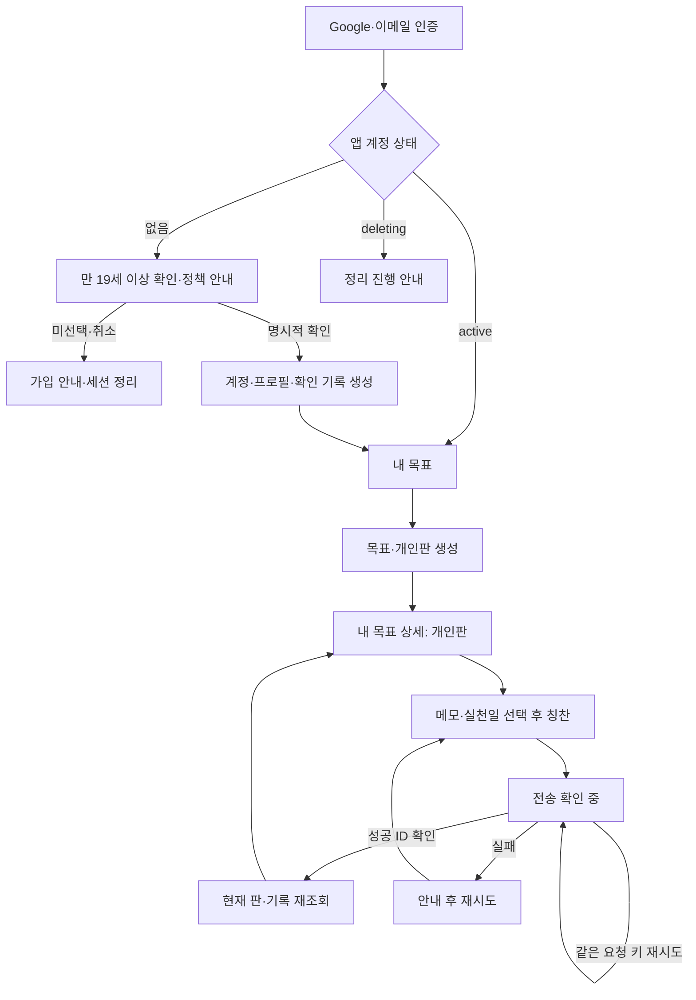
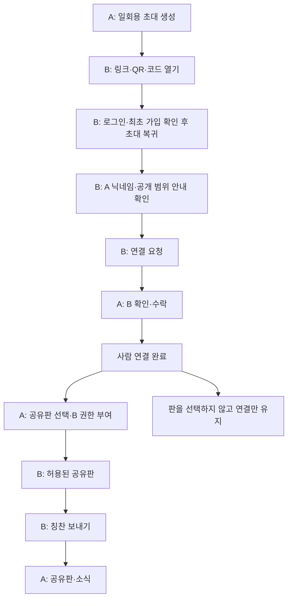
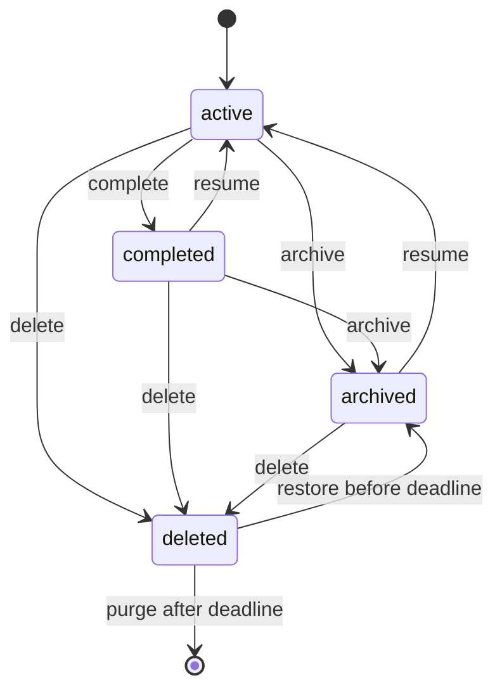

# 화면과 상태 흐름 설계

버전: 0.2.0 / 상태: UI02~UI08 기본 구현, UI09 API 연결 완료·화면 대기. 접근성·기기·PWA·제품 수락 검증은 W11/W15에서 수행

정책: [제품 규칙](../policies/product-rules.md), [생명주기](../policies/data-lifecycle.md), [응답 필드](../policies/access-and-responses.md). 화면 이름·구성은 개발 기준이며 브랜드·색상은 후속 검토한다.

## 화면 단위

| 화면 ID | 화면·주체 | 표시 데이터·동작 | 빈/오류·완료 상태 | 요구 |
| --- | --- | --- | --- | --- |
| UI01 | 로그인·가입 확인 | 성인 개인 서비스 안내, Google·이메일 OTP, 최초 가입의 만 19세 이상 확인, 초대 복귀 | 확인 미선택·이전 정책은 가입 불가, 메일 지연·잘못된 번호·외부 브라우저 대안 | REQ-001 |
| UI02 | 내 목표 | 내 제목·상태, 개인/공유 개수 별도, 새 목표 | 첫 목표 만들기, 로딩·재시도 | REQ-002~004 |
| UI03 | 목표 생성·설정 | 제목·개인 메모·판별 목표 개수, 공유 정보 별도 | 입력 오류·상한·revision 충돌 | REQ-002 |
| UI04 | 내 목표 상세 | 개인/받은 칭찬 전환·목록·지난 회차 | 새 칭찬 가능 active, 완료/보관 안내·재개 | REQ-003/004/012 |
| UI05 | 개인 기록·정리 | 메모·실천일·취소, 취소 효과와 본문 제거 안내 | 전송 확인 중·실패·성공, 취소 상태 | REQ-003/007 |
| UI06 | 연결·초대 | 링크/QR/코드, 요청 수락·거절·철회·차단 | 만료/사용 불가, 연결만 수락 가능 | REQ-005 |
| UI07 | 공유 대상 설정 | 본인 공유판 contributor 선택·해제 | 활성 연결·50명 상한, 과거 권한 미복구 안내 | REQ-006 |
| UI08 | 지인의 공유판 | 공유 제목·공유 개수·내가 보낸 칭찬, 보내기 | 권한 없음은 접근 불가, 완료/보관은 읽기 안내 | REQ-004/006 |
| UI09 | 소식·보낸함 | 수신자 소식·읽음, 본인 peer 기록·취소 | 대상 삭제/권한 만료, 현재 상대 개수 비표시. W10-A API 완료, 화면은 후속 | REQ-008/009 |
| UI10 | 휴지통 | 본인 제목·revision·삭제/마감 시각, 복구 | 30일 이후 복구 불가, archived로 복구 | REQ-002/010 |
| UI11 | 계정 설정·탈퇴 | 프로필·시간대·로그아웃, 재인증·삭제 범위 설명 | 삭제 접수 후 접근 중단, 완료 시간은 목표로 안내 | REQ-001/010 |

UI06 연결·초대·요청·차단은 W09-A API와 W09-C 화면으로 구현했다. 일회 secret은 fragment를 처리하면 현재 주소에서 지우고 성공/취소 뒤 메모리 상태도 비운다. 연결 수락은 목표별 권한을 부여하지 않는다. UI07은 목표 설정에서 활성 연결된 사용자를 판마다 별도로 허용/회수한다. UI08은 서버가 현재 grant를 확인한 공유판 목록에서 참여판을 열어 회차 수를 보고 자신의 peer 칭찬을 작성한다. 해당 화면에서 상대의 다른 기록과 개인 목표 원본은 노출하지 않는다. 목록은 `list_my_shared_boards`를 통해 현재 연결 generation·차단·grant를 재검사한다. 구현·검사 범위와 제품 수락 미실행 항목은 [W09-C 증거](../quality/reports/w09-c-shared-board-ui-check-2026-10-08.json)에 기록한다.

모든 핵심 화면은 목록 대안·키보드·읽기 도구·큰 글씨를 지원한다. 개인/공유를 색만으로 구분하지 않는다. 버튼은 현재 역할에 맞게 표시하되 실제 권한은 서버·DB에서 다시 검사한다.

## 가입 확인

신규 Auth 사용자는 /signup에서 “저는 만 19세 이상입니다.”를 직접 선택한다. 기본값은 미선택이며 서버 확인 전에는 목표·초대 화면을 열지 않는다. 생년월일·전화·신분증 입력은 없다. API를 직접 호출해도 같은 확인·정책 검사를 수행한다. 취소하면 현재 인증 세션·임시 초대를 정리하고 가입 안내로 돌아간다. 기존 active 계정은 최초 확인 화면을 반복하지 않는다. 성인 확인과 실제 공개 약관·개인정보 관련 동의는 구분한다. [상세 정책](../policies/audience-and-signup.md)

## 첫 개인 기록

결과를 받지 못한 경우 기존 입력·요청 키를 유지한다. 사용자가 실패한 요청을 재시도할 때 새 키를 만들지 않는다. 입력을 새로 바꿔 독립 기록을 제출할 때만 새 키를 생성한다. 성공하기 전에 알을 확정 표시하지 않는다.

## 연결에서 공유 칭찬까지

연결 수락 화면에서 목표를 선택하는 UX를 제공할 수 있지만 연결 완료 뒤 명시적 grant 작업으로 실행한다. grant 실패는 연결까지 실패한 것으로 표시하지 않는다. 임시 초대 비밀은 해당 탭만 사용하고 처리·취소·로그아웃 시 제거한다.

## 목표 상태

active만 새로운 칭찬을 받는다. 회차 완성으로 목표를 자동 completed 처리하지 않는다. deleted는 일반 경로에서 접근 불가, 휴지통은 주인만 본다. 복구는 판 권한을 회복하지 않는다.

## 오류와 접근성

| 상황 | 사용자 안내·다음 행동 |
| --- | --- |
| 빈 공유판 | 칭찬이 아직 없음을 표시, 개인 기록은 계속 사용 |
| 완료/보관 목표 | 새 입력이 닫혔음을 표시, 주인에게 재개 제공 |
| 취소·제외 | 바뀌는 회차·개수와 되돌릴 수 없음 안내 |
| 숨김 | 개수 유지, 숨긴 기록 메뉴에서 복원 |
| 409 수정 충돌 | 최신 상태 다시 읽고 내용 확인 후 수정 |
| 401 | 현재 입력은 안전한 범위에서 유지, 로그인 후 다시 확인 |
| 404 | 접근할 수 없음·목록으로 돌아가기, 차단 여부 추측 안내 없음 |
| 429 | 서버 재시도 시각·대기 시간 |
| 503·전송 불확실 | 실패/확인 중을 구분, 같은 키로 상태 확인·재시도 |
| 오프라인 | 온라인 필요, 기록 성공으로 확정하지 않음 |
| 삭제된 원문 소식 | 원문이 없음을 안내, 비공개 본문 복제해서 표시하지 않음 |

UI02~UI05는 W08-D에서 local fixture API를 사용하는 기본 화면으로 구현했다. 실제 UI 쓰기 제출의 제품 수락, iOS/Android·메신저·큰 글씨·키보드 검증은 완료되지 않았다. TC-UX-001/002와 TC-CACHE-001은 W11/W15에서 수행한다. 나머지 화면은 계속 설계 원본이다.
