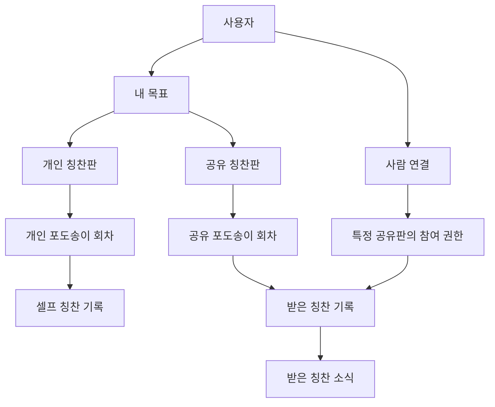

# 차곡찬 — 기능 확장 설계

작성일: 2026-10-07 / 적용 기획: [v0.2](product-plan-v0.2.md)

목적: 목표별 셀프 칭찬과 지인 칭찬을 분리해 제공하면서, 기존 기록을 유지한 채 여러 기능으로 확장할 수 있도록 구조를 정리한다. 기술 기준은 [개발 스택·아키텍처](technical-architecture.md), 권한은 [로그인·권한](auth-and-permissions.md)을 따른다. 아래는 확장 원칙이며 실제 DB 스키마와 앱 구현은 후속 개발에서 검증한다.

## 테마와 서비스 브랜드

서비스 이름은 칭찬·작은 성취·응원을 담고 포도 모양에 의존하지 않는다. 포도는 표현 테마이며 사용자는 후에 다른 테마로 바꿀 수 있어야 한다. [브랜드 기준](branding/brand-guide.md), [이름 검토 기록](branding/name-candidates-2026-10-07.md)

공통 기능 이름은 목표·개인/공유 칭찬판·칭찬 기록·회차로 둔다. 테마는 그림·배치·색·효과를 표현한다. 테마 변경은 동일 목표·판·회차·칭찬 ID, 작성자·본문·날짜·개수·완성 이력·권한을 유지하며 새 회차를 자동 생성하지 않는다. 테마 선택·저장 UI는 후속 구현 범위다.

## 확장에 필요한 기본 단위

| 단위 | 책임 | 첫 버전에서 담을 정보·관계 | 확장할 방향 |
| --- | --- | --- | --- |
| 사용자 | 서비스 안의 한 사람 | 고정 사용자 ID, 표시 이름, 로그인 수단 | 여러 로그인 수단·프로필·그룹 참여 |
| 사용자 연결 | 두 사람의 연결 상태 | 요청·수락·거절·해제·차단 | 관계별 설정과 연결 그룹 |
| 목표 | 무엇을 위해 모으는가 | 주인, 이름, 설명, 진행·완료·보관 상태 | 기간·분류·수치·그룹 소유 |
| 칭찬판 | 누가 어떤 규칙으로 채우는가 | 목표 ID, 개인/공유 종류, 개수 설정, 권한 | 공동 목표, 하루 한 번·주간 규칙 |
| 칭찬판 회차 | 한 번 완성할 묶음 | 판 ID, 회차, 당시 개수 설정, 시작·완성 날짜 | 월별·기간별 묶음과 특별 테마 |
| 칭찬 기록 | 누가 누구에게 무엇을 남겼는가 | 목표·판·회차 ID, 작성자·수신자, 개인/지인 출처, 문구·시간·반영 상태 | 사진, 댓글, 감사 표현, 외부 출처 |
| 판 참여 권한 | 특정 판에서 허용할 행동 | 사용자 ID, 판 ID, 조회·칭찬 부여 권한, 유효 상태 | 보기만 가능, 공동 관리, 기여 역할 |
| 활동·소식 | 어떤 변화가 있었는가 | 칭찬 수신, 연결 요청, 회차 완성, 읽음 | 푸시·이메일·묶음 알림·배지 |

사용자 ID는 로그인 제공자의 식별자와 분리한다. 로그인 수단을 추가해도 같은 사람의 목표·연결·칭찬 기록이 유지되게 한다. 화면에 쓰는 ‘친구 연결’과 로그인 제공자 연동은 별개의 개념이다.

## 관계 개요

개인판과 공유판에는 각자 진행 중인 회차와 완료한 회차가 있다. 사용자 관계가 연결돼 있어도 판별 권한이 있어야 조회·부여할 수 있다. 위 도식의 화살표는 제품 관계를 표현하며 실제 API나 데이터베이스 제약을 뜻하지 않는다.

키·외래키·유일성·상태를 포함한 관계 설계는 [데이터 ERD](data-erd.md)에 작성했다. 실제 SQL 전에 정할 정책과 API·검증 기준은 [구현 전 고려사항](pre-implementation-plan.md)을 따른다.

공유용 제목·설명은 개인 목표 원본과 분리한다. 칭찬 권한자는 공유판 개수와 자신이 보낸 칭찬만 읽으며, 다른 참여자의 본문을 자동으로 읽지 않는다. 보기 전용·그룹 기능을 추가할 때도 새 공개 범위를 명시적으로 정한다.

## 개인·공유 분리를 유지할 원칙

- 개인 기록은 개인판의 회차에만, 지인의 칭찬은 공유판의 회차에만 연결한다.
- 개인 개수, 공유 개수, 실제 실천량은 별도 값이다. 받은 칭찬을 독서량·운동 시간·실제 목표 달성으로 환산하지 않는다.
- 목표당 개인판과 공유판을 각각 만들 수 있다. 목표 단위에 여러 판을 둘 수 있는 관계를 준비해 이후 공동판·기간별 판을 추가할 수 있게 한다.
- 첫 버전의 개인판·공유판은 각각 현재 회차를 하나 관리한다. 회차를 마쳐도 과거 기록은 유지한다.
- 포도알의 위치와 색상은 표시 방식이다. 칭찬 ID와 기록 내용은 테마를 바꿔도 유지한다.
- 판의 설정을 바꾸면 완료한 회차의 당시 목표 개수와 규칙은 보존한다. 새 규칙은 다음 회차 적용을 기본으로 검토한다.

## 칭찬 처리와 기록 일관성

칭찬을 받을 때 확인할 순서는 ‘사용자 확인 → 현재 연결·판 권한 확인 → 목표 상태·규칙 확인 → 칭찬 저장과 회차 반영 → 소식 생성’으로 제안한다.

| 상황 | 설계 원칙 |
| --- | --- |
| 중복 탭·네트워크 재전송 | 같은 요청을 구분할 키로 같은 칭찬은 한 번만 반영 |
| 여러 사람이 동시에 마지막 알 부여 | 회차 결정과 기록 반영을 하나의 일관된 처리로 수행, 모두 기록 |
| 완성 뒤 칭찬 도착 | 진행 중인 목표는 다음 회차를 생성하여 수신하는 기본안 |
| 목표 완료·보관 뒤 칭찬 도착 | 신규 부여를 닫고 보낸 사용자에게 상태 안내 |
| 기록 취소 | 취소 상태를 남기고 해당 회차만 다시 계산 |
| 완료판에서 취소 | 완성 조건을 다시 확인, 이후 회차의 기록은 그대로 유지 |
| 연결·공유 해제 | 최신 권한으로 새 조회·부여 차단, 이미 저장한 기록 처리 정책 적용 |
| 알림 전달 실패 | 저장한 칭찬은 유지하고 알림만 재시도 |
| 오프라인에서 공유 칭찬 작성 | 첫 버전은 온라인 전송만 제공. 향후 대기를 지원하면 실제 반영 전 최신 권한 재확인 |

진행 개수는 유효한 칭찬 기록으로 확인할 수 있게 한다. 숨긴 칭찬, 취소한 칭찬, 승인 대기 칭찬은 각각 구분해 향후 승인 옵션과 기록 정리에 대응한다. 첫 버전에서 필요한 상태만 활성화한다.

## 기능 영역과 의존 관계

| 영역 | 담당 기능 | 확장 시 지킬 경계 |
| --- | --- | --- |
| 계정·연결 | 로그인, 사람 연결, 차단 | 다른 기능에서 동일 사용자·연결 상태 참조 |
| 목표·칭찬판 | 목표, 판 종류, 회차, 기록 규칙 | 목표 의미와 기록 표시 방식 구분 |
| 칭찬·권한 | 추가·취소, 작성 주체, 공유 범위 | 화면·위젯·외부 연동이 같은 권한과 기록 규칙 사용 |
| 알림 | 수신 소식, 읽음, 전송 설정 | 칭찬 저장의 성공과 알림 전달 성공 구분 |
| 테마·표현 | 포도 그림, 효과, 테마 | 목표·칭찬 원본 데이터 유지 |
| 확장 기능 | 보상·배지·리포트·그룹 | 기존 칭찬·완성 정보를 이용하고 각 기능의 추가 정보 관리 |

첫 구현은 하나의 앱·서버 안에서 기능 영역을 나누는 방식으로 충분하다. 초기부터 모든 확장 후보의 서버·스키마·플러그인 체계를 만들 필요는 없다. ID, 책임, 관계, 권한과 기록 규칙을 명확히 하는 것을 우선한다.

## 확장 후보와 준비할 부분

| 후보 | 추가 경험 | 기존 구조로 연결할 부분 | 별도로 결정할 사항 |
| --- | --- | --- | --- |
| 테마 | 포도 외 다양한 판 | 판·회차의 표현 설정 | 모양별 목표 개수와 가격 |
| 수치·주기 목표 | 10권 읽기, 주 3회 운동 | 목표 설정 + 실천 기록 + 판 규칙 | 칭찬 1알과 실천량의 관계 |
| 공동 목표·그룹 | 여러 사람이 함께 채우기 | 목표 소유 주체 + 참여 권한 | 그룹 생성, 역할, 탈퇴, 기여 표시 |
| 보상·배지 | 회차 완성과 누적 기록을 축하 | 완성 이벤트 + 별도 수여 기록 | 수여 조건, 취소·재완성 처리 |
| 위젯·시계 | 앱 밖에서 셀프 칭찬 기록 | 공통 기록 동작 | 플랫폼·오프라인·동기화 |
| 사진·댓글 | 칭찬의 맥락과 감사 표현 | 칭찬 ID에 연결한 부가 정보 | 공개 범위, 정리, 저장 비용 |
| 리포트·출력 | 월간 성취·완성판 공유 | 목표·회차·칭찬 조회 | 개인/공유별 포함 범위 |
| 외부 서비스 | 운동·독서 기록 가져오기 | 실천 기록의 출처와 연결 권한 | 자동 기록과 칭찬 부여 규칙 |
| AI 문구 보조 | 칭찬 문구 추천 | 사용자가 선택한 맥락 | 데이터 제공 범위와 문구 확정 주체 |

공동 목표는 현재 확정된 ‘내 목표에 지인이 칭찬하기’에서 파생하는 확장 후보다. 첫 버전의 공유판은 한 사람의 목표에 속한다.

## 설계 검증 기준

1. 여러 목표의 개인·공유 개수가 서로 영향을 주지 않는다.
2. 테마를 교체해도 칭찬 작성자·내용·날짜·진행 개수가 유지된다.
3. 계정 로그인 수단을 바꿔도 동일한 내 목표와 연결을 찾는다.
4. 연결만으로 개인판이나 허용하지 않은 목표가 공개되지 않는다.
5. 부여·취소·중복·동시 수신 뒤에도 개수와 원본 기록이 일치한다.
6. 공동 목표를 추가해도 기존 개인 소유 목표와 받은 칭찬의 의미가 유지된다.
7. 보상·리포트를 추가할 때 칭찬 작성 과정에 해당 기능의 세부 처리를 섞지 않는다.

이 기준은 구현 시 검증할 요구이며 현재 테스트 통과나 구현 완료를 뜻하지 않는다.
