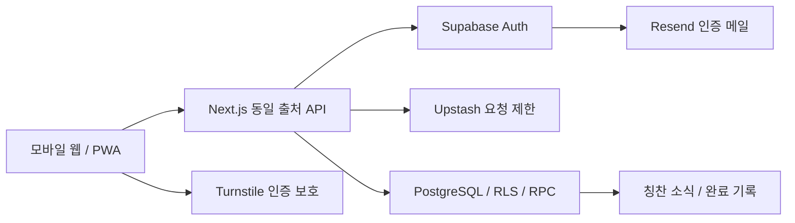

# 개발 스택과 기술 아키텍처

결정일: 2026-10-07 / 상태: 개발 기준 결정, 앱 실행·환경 검사 기반 구현. 업무 기능·서비스 개설 전

적용 제품: [기획 v0.2](product-plan-v0.2.md). 목표마다 개인 포도송이와 공유 포도송이를 분리하고, 연결된 지인이 허용된 공유판에 칭찬을 준다. 이 문서의 선택을 첫 개발의 기준으로 사용한다.

## 결정 요약

| 영역 | 결정 |
| --- | --- |
| 첫 출시 | 모바일 웹/PWA. 휴대폰·태블릿·PC에서 같은 서비스 이용 |
| 웹 프레임워크 | Next.js 16 안정 계열, App Router, React, TypeScript strict |
| 런타임·패키지 관리 | Node.js 24 LTS, pnpm, 잠금 파일로 버전 고정 |
| UI | Tailwind CSS, 접근 가능한 기본 컴포넌트, SVG 포도송이 |
| 입력·클라이언트 상태 | Zod로 서버 입력 검증, TanStack Query로 서버 상태 조회·갱신 |
| API | Next.js Route Handlers 기반의 동일 출처 API, /api/v1로 시작 |
| 인증 | Supabase Auth: Google 로그인 + 이메일 OTP |
| 개발 중 사용자 | 서버가 로컬 가상 Auth 세션 준비. 로그인 화면 생략, 실제 제공자 연동은 출시 준비 때 |
| 데이터베이스 | Supabase PostgreSQL, SQL 마이그레이션, RLS, 원자적인 기록 RPC |
| 인증 SDK | 서버에서만 supabase-js와 @supabase/ssr 사용 |
| 요청 제한 | Upstash Redis와 ratelimit, 중요 쓰기에는 DB 제한도 적용 |
| 인증 메일 | Resend를 Supabase의 Custom SMTP로 연결 |
| 봇 방어 | 이메일 인증 흐름에 Cloudflare Turnstile, Supabase Auth 검증 사용 |
| 배포 | Vercel Pro + Supabase Pro, 서울 리전 기준 |
| 린트·타입 | Biome 2.5.15, TypeScript strict·Next.js 빌드 |
| 테스트 | 현재 Node 내장 환경 단위 검사. 업무 구현 때 Vitest·Playwright·Supabase CLI/pgTAP 추가 |
| 형상관리 | 추후 GitHub 비공개 저장소 + GitHub Actions 연결 |

2026-10-07 공식 Next.js 문서에는 16.4.0이 표시되며 Node.js 24는 LTS로 안내된다. 실제 설치 시점에 이 계열의 보안 수정 여부와 호환성을 다시 확인하고 정확한 버전을 잠금 파일에 기록한다. 운영 배포에서 자동으로 latest를 설치하지 않는다. [Next.js 문서](https://nextjs.org/docs/app/guides/data-security), [Node.js 릴리스](https://nodejs.org/en/about/previous-releases)

## 이 스택을 선택한 이유

지인을 초대하는 서비스는 링크로 접속해 로그인하고 칭찬을 주는 흐름이 중요하다. 첫 출시를 모바일 웹/PWA로 정하면 이 흐름을 하나의 배포로 검증할 수 있다. 홈 화면 설치를 제공하고 개인·공유 포도송이 UI를 같은 코드로 구현한다. [PWA 공식 가이드](https://nextjs.org/docs/app/guides/progressive-web-apps)

목표·판·회차·칭찬·참여 권한에는 관계와 트랜잭션이 필요하므로 PostgreSQL을 사용한다. Supabase에서 인증과 데이터베이스를 운영하고, 데이터 접근은 서버와 DB에서 함께 제한한다. 테마와 그룹 확장은 기존 목표·칭찬 ID를 유지한다.

네이티브 앱이 필요한 시점에는 React Native/Expo를 후보로 검토하며 같은 사용자 ID, DB, 칭찬 규칙을 사용한다. 모바일 앱의 화면 코드와 인증 토큰 보관은 별도로 구현한다. PWA가 네이티브 위젯·플랫폼 연동을 모두 제공한다고 가정하지 않는다.

## 요청 처리 구조



브라우저는 앱 API를 호출하고, 인증과 DB 요청은 서버가 사용자 세션으로 실행한다. 브라우저에 Supabase 로그인 토큰을 내려주거나 직접 DB 변경을 맡기지 않는다. 첫 버전의 소식은 앱 안에서 조회하고 화면이 활성화된 동안 갱신한다. 실시간 채널과 웹 푸시는 확장 단계로 둔다.

Next.js는 API 계층으로 사용하고, 여러 레코드의 원자적인 변경은 PostgreSQL 함수에서 처리한다. Route Handler도 외부에서 호출 가능한 HTTP 엔드포인트이므로 요청마다 인증·권한을 검사한다. [Next.js BFF 가이드](https://nextjs.org/docs/app/guides/backend-for-frontend)

## 데이터 구조와 공개 범위

| 데이터 | 저장·접근 원칙 |
| --- | --- |
| app_users | Auth UUID와 같은 앱 사용자 ID, 계정 상태·시간대·최초 성인 확인 시각/정책 버전. 본인 전용 |
| profiles | 닉네임·기본 아바타. 본인 및 허용된 관계에 최소 정보만 제공. 이메일은 공개 프로필에 포함하지 않음 |
| goals | 주인, 이름, 개인 설명, 실제 목표 상태. 주인만 원본 조회·수정 |
| boards | 목표, 주인, personal/shared 종류, 기록 규칙, 현재 회차. 종류는 기록이 생긴 뒤 다른 종류로 변경하지 않음 |
| shared_board_profiles | 공유용 제목·공유 설명. 공유판에 허용된 사용자에게만 제공 |
| bunches | 판별 회차, 당시 목표 개수, 진행 개수, 완성 상태·날짜 |
| praises | 판·회차·작성자·수신자·출처·문구·시간·취소·제외 상태 |
| connections / blocks | 두 사용자 연결 상태와 한쪽의 차단 상태 |
| board_members | 판별 참여자와 권한, 활성·해제 상태 |
| connection_invites | 초대 비밀의 해시, 발급자, 만료, 사용·폐기 상태 |
| connection_requests | 초대 사용 요청과 최종 수락·거절·철회·만료, 연결 관계 참조 |
| notifications | 수신자의 소식과 읽음 상태 |
| audit_events | 권한 변경·취소·관리 이벤트의 최소 정보 |

구체적인 키·관계·회차·상태 설계는 [데이터 ERD v0.3](data-erd.md)를 따른다. ERD에는 중복 요청·재인증·DB 요청 제한·탈퇴 작업의 보조 테이블도 표현했다. 삭제·탈퇴·날짜·설정 변경은 [정책 JSON](../policies/app-policy.json)과 [제품 규칙](policies/product-rules.md), [생명주기](policies/data-lifecycle.md)에 개발 기준으로 구체화했다. [개발 절차](development/README.md)의 준비·완료 조건으로 구현 상태를 관리한다.

RLS는 행 단위 제한이다. 개인 목표의 설명과 개인 칭찬 메모가 들어 있는 행을 지인에게 허용하지 않는다. 공유용 표시 정보는 별도로 저장해 공유 범위를 분명히 한다. 단순히 프런트엔드에서 필드를 숨기는 것으로 접근 통제를 대신하지 않는다.

칭찬은 한 판·한 회차에만 속하며 개인·공유 개수를 합산하지 않는다. 실제 실천량은 칭찬 개수와 별도의 개념으로 유지한다. 그룹과 공동 목표를 도입할 때 소유 주체·참여 역할을 확장하되 기존 개인 소유 목표는 보존한다.

## DB 접근 결정

- 읽기는 사용자 JWT가 적용된 DB 클라이언트와 RLS를 사용한다. 로그인되지 않은 역할에는 제품 데이터 읽기·쓰기를 허용하지 않는다.
- 목표 생성, 칭찬 추가·취소, 연결 수락, 공유 권한 변경은 지정한 RPC로만 처리한다. 제품 테이블의 직접 INSERT·UPDATE·DELETE 권한은 일반 사용자에게 주지 않는다.
- RPC는 현재 사용자의 ID를 검증된 세션에서 얻는다. 클라이언트가 제출한 owner_id, actor_id, recipient_id를 권한의 근거로 사용하지 않는다.
- 원자적인 처리에 필요한 SECURITY DEFINER 함수는 최소 권한 소유자, 고정 search_path, 명시적 스키마, 함수별 실행 권한, 내부 권한 검사로 제한한다. 이 함수가 RLS를 자동으로 지켜 준다고 가정하지 않는다.
- 세션·권한 확인 보조 함수는 비공개 스키마에 두고 현재 사용자의 허용 여부만 반환한다. 읽기 뷰를 공개할 때는 security_invoker와 실제 역할 테스트를 적용한다.

Supabase의 RLS·뷰·권한 상승 함수 동작은 공식 문서를 기준으로 검토했다. [RLS 문서](https://supabase.com/docs/guides/database/postgres/row-level-security)

## 기록 처리 결정

1. 서버에서 세션, 입력 형식, CSRF와 요청 빈도를 확인한다.
2. RPC에서 활성 사용자·세션·연결·차단·판 참여 권한을 다시 확인한다.
3. 해당 판의 처리 순서를 잠금으로 직렬화하고 유효한 현재 회차를 정한다.
4. 칭찬과 진행 개수, 완성 상태, 수신 소식을 한 트랜잭션으로 기록한다.
5. 동일 작성자·요청 키가 재전송되면 기존 결과를 반환한다.

공유 해제·연결 해제도 같은 권한 레코드의 잠금 순서를 사용한다. 해제 처리가 완료된 뒤의 신규 부여는 거절한다. 이미 먼저 완료된 칭찬은 받은 기록으로 남는다. 유효한 칭찬 하나가 여러 회차에 중복 반영되지 않게 한다.

새 회차 생성과 기존 회차의 취소를 분리한다. 취소로 이전 완료판의 개수가 줄어도 이후 회차 기록을 옮기지 않으며 현재 회차 포인터를 그대로 유지한다. 개수가 줄어든 이전 회차는 불완전한 보관 회차로 표시한다.

## 캐시와 오프라인 범위

첫 버전의 기록·연결·칭찬 전송은 온라인으로 처리한다. 오프라인에서는 연결 상태를 안내하고 성공하지 않은 요청을 성공한 것으로 표시하지 않는다.

PWA 캐시는 공개 정적 파일·아이콘에만 적용한다. 로그인 응답, 사용자별 HTML·RSC 응답, 목표·칭찬 API, 초대·인증 응답은 private, no-store로 설정하고 서비스 워커 캐시에 저장하지 않는다. 로그아웃·계정 전환 시 클라이언트 조회 캐시와 임시 초대 정보를 비운다.

## 개발 폴더 구성 — 구현 시 생성

```text
src/app/                  화면, 라우트, API
src/features/goals/       목표와 판 UI
src/features/praise/      칭찬 UI와 클라이언트 요청
src/features/connections/ 연결 UI
src/server/auth/          서버 세션·재인증
src/server/policies/      권한·요청 제한
src/server/services/      제품별 API 처리
src/domain/               목표·판·칭찬 타입과 순수 규칙
src/lib/                  공용 검증·오류·SDK 설정
supabase/migrations/      테이블, RLS, 함수, 제약 변경
supabase/tests/           허용·거절·동시성 관련 DB 검증
tests/e2e/                사용자 흐름
docs/                     기획·결정·운영 문서
```

모듈을 구분한 하나의 애플리케이션으로 시작한다. 실제 필요가 생기면 알림 작업·그룹 기능 등을 분리한다. 앱 기능 확장마다 별도 서버를 먼저 만들지는 않는다.

## 운영 기반과 구현 순서

Upstash 요청 제한은 서버 인스턴스 간 공유되게 한다. 중요 RPC에도 사용자별 부여·초대 제한을 두어 Data API 직접 호출이 앱의 제한을 우회하지 않게 한다. 제한 저장소 오류가 나면 로그인 메일 발송·초대·칭찬 쓰기는 임시 거절하고 읽기 흐름은 유지한다. 공식 라이브러리의 기본 timeout 동작을 그대로 보안 정책으로 사용하지 않는다. [Upstash 문서](https://upstash.com/docs/redis/sdks/ratelimit-ts/overview)

Resend는 인증 메일 전달에 사용한다. 일반 지인 초대 메일 발송은 첫 버전에 넣지 않고 사용자가 링크를 직접 공유한다. Supabase 기본 SMTP는 운영용으로 삼지 않는다. [Custom SMTP](https://supabase.com/docs/guides/auth/auth-smtp), [Resend 연동](https://supabase.com/partners/resend)

2026-10-08 사용자 결정에 따른 구현 순서: 로컬 환경 → DB 마이그레이션 → 데이터·권한·RPC → [로컬 사용자·서버 API](development/local-development.md) → 개인 목표·칭찬 → 연결·공유 칭찬 → 소식·완성판 → PWA → 실제 로그인 연동·스테이징 검증 → 배포. 상세 상태와 선행 조건은 [진행표](development/backlog.md), 출시 기준은 [로그인·권한](auth-and-permissions.md), [보안 위협](security-threat-model.md), [배포·Git](deployment-and-git.md)을 따른다.
